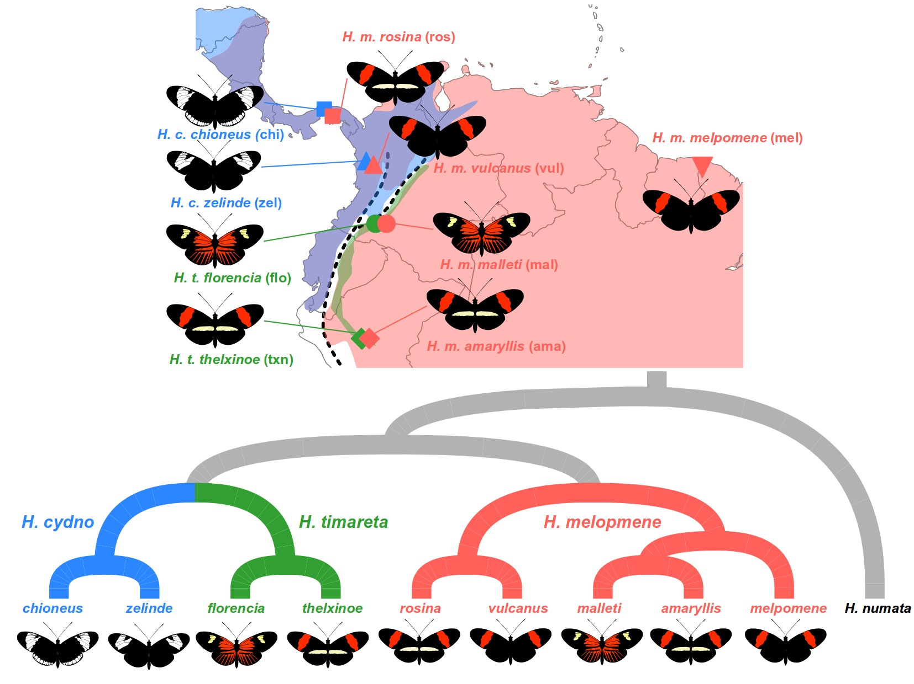

# Tutorial: *ABBA* *BABA* statistics using genome wide SNP data

___
## Requirements
* Python 2.7
* Numpy 1.10+
* R 3.0+

___
## Introduction

ABBA BABA statistics (also called 'D statistics') provide a simple and powerful test for a deviation from a strict bifurcating evolutionary history. They are therefore frequently used to test for introgression using genome-scale SNP data (e.g from whole genome sequenciing or RADseq).

In this practical we will perform an ABBA BABA analysis using a **combination of available software and some code written from scratch in R**. We will analyse genomic data from several populations of *Heliconius* butterflies.

#### Workflow
Starting with genotype data from multiple individuals, we first **infer allele frequencies** at each SNP. We then **compute the *D* statistic** and then use a **block jackknife** method to test for a significant deviation from the null expectation of *D*=0. Finally we **estimate *f* the 'admixture proportion'**.

#### Data

We will study multiple races from three species: *Heliconius melpomene*, *Heliconius timareta* and *Heliconius cydno*. These species have partially overlapping ranges and they are thought to hybridise where they occur in sympatry. Our sample set includes two pairs of sympatric races of *H. melpomene* and *H. cydno* from Panama and the western slopes of the Andes in Colombia. There are also two pairs of sympatric races of *H. melpomene* and H. timareta from the eastern slopes of the Andes in Colombia and Peru. Finally, there are two samples from an outgroup species *Heliconius numata*, which are necessary for performing the ABBA BABA analyses.

All samples were sequenced using high-depth **whole-genome sequencing**, and genotypes have been called for each individual for each site in the genome using a standard pipeline. The data has been filtered to retain only **bi-allelic** single nucleotide polymorphisms (SNPs), and these have been further **thinned** to reduce the file size for this tutorial.

#### Hypotheses

We hypothesize that hybridisation between species in sympatry will lead to sharing of genetic variation between *H. cydno* and the **sympatric** races of *H. melpomene* from the west, and between *H. timareta* and the corresponding sympatric races of *H. melpomene* from the east of the Andes. There is also another race of *H. melpomene* from French Guiana that is **allopatric** from both *H. timareta* and *H. cydno*, which should have not experienced recent genetic exchange with either species and therefore serves as a control.

In addition to testing for the presnece of introgression, we will test the hypothesis that some parts of teh genome experience more introgression than others. Specifically, we know that at least one locus on the Z sex chromosome causes sterility in hybrid females between these species, indicating an incompatibility between the autosomes of one species and the Z chromosome of the other. We therefore might expect reduced introgression on the Z chromosome compared to autosomes.




#### A genome wide test for introgression

In its simplest formulation, the *ABBA* *BABA* test relies on counts of sites in the genome that match the *ABBA* and *BABA* genotype patterns. That is, given three ingroup populations and an outgroup with the relationship (((P1,P2),P3),O), and given a single genome sequence representing each population (ie, H1, H2 and H3), ***ABBA*** sites are those at which H2 and H3 **share a derived allele ('B')**, while **H1 has the ancestral state ('A')**, as defined by the outgroup sample. Likewise, ***BABA*** represents sites at which **H1 and H3 share the derived allele**.

Ignoring recurrant mutation, the two SNP patterns can only be produced if some parts of the genome have genealogies that do not follow the 'species tree', but instead group H2 with H3 or H1 with H3. If the populations split fairly recently, such 'discordant' genealogies are expected to occur in some parts of the genome due to variation in lineage sorting. In the absence of any deviation from a strict bifurcating topology, **we expect roughly equal proportions of the genome to show the two discordant genealogies** (((H2,H3),H1),O) and (((H1,H3),H2),O). By counting *ABBA* and *BABA* SNPs across the genome (or a large proportion of it), we are therefore **approximating the proportion of the genome represented by the two discordant genealogies**, which means **we expect a 1:1 ratio of *ABBA* and *BABA* SNPs**. A deviation could come about as a result of gene flow between populations P3 and P2 for example, although it could also indicate other phenomena that break our assumptions, such as ancestral population structure, or variable substitution rates.

To quantify the deviation from the expected ratio, we calculate *D*, which is the difference in the sum of *ABBA* and *BABA* patterns across the genome, divided by their sum:

*D* = \[sum(*ABBA*) - sum(*BABA*)\] / \[sum(*ABBA*) + sum(*BABA*)\]

**Therefore, D ranges from -1 to 1, and should equal 0 under the null hypothesis. D > 1 indicates an excess of *ABBA*, and D < 1 indicates an excess of *BABA*.**

If we have multiple samples from each population, then counting *ABBA* and *BABA* sites is less straghtforward. One option is to consider only sites at which all samples from the same population share the same allele, but that will discard a large amount of useful data. A preferable option is to use the allele frequencies at each site to quantify the extent to which the genealogy is skewed toward the *ABBA* or *BABA* pattern. This is effectively equivalent to counting *ABBA* and *BABA* SNPs using all possible sets of four haploid genomes at each site. *ABBA* and *BABA* are therefore no longer binary states, but rather numbers between 0 and 1 that represent the frequency of allele combinations matching each genealogy. They are computed based on the frequency of the derived allele (*p*) and ancestral allele (1-*p*) in each population as follows:

*ABBA* = (1-*p1*) x *p2* x *p3* x 1-*pO*

*BABA* = *p1* x (1-*p2*) x *p3* x 1-*pO*

## The Practical

### Preparation

Open a terminal window and navigate to a folder where you will run the excersise and store all the input and output data files.

This tutorial makes use of a collection of python scripts that must be downloaded from [GitHub](https://github.com/simonhmartin)

```bash
git clone https://github.com/simonhmartin/genomics_general
```

### Genome wide allele frequencies

To compute these values from population genomic data, we need to first determine the frequency of the derived allele in each populaton at each polymorphic site in the genome. We will compute these from the *Heliconius* genotype data provided using a python script. The input file has already been filtered to contain only bi-allelic sites. The frequencies script requires that we define populations. These are defined in the file `hel92.pop.txt`.

```bash
python genomics_general/freq.py -g data/hel92.DP8MP4BIMAC2HET75dist250.geno.gz \
-p mel_mel -p mel_ros -p mel_vul -p mel_mal -p mel_ama \
-p cyd_chi -p cyd_zel -p tim_flo -p tim_txn -p num \
--popsFile data/hel92.pop.txt --target derived \
-o data/hel92.DP8MP4BIMAC2HET75dist250.derFreq.tsv.gz
```
By setting `--target derived` we obtain the frquency of the derived allele in each population at each site. This is based on using the final population specified (*H. numata silvana*, or '*slv*') as the outgroup. Sites at which this population is not fixed for the ancestral state are discarded.

### Genome wide ABBA BABA analysis

**(NOTE: here we're working in R, or R Studio if you prefer)**

To learn how the ABBA BABA test works, we will writing the code from scratch to do the test. **Start a new R script**. This will make it easy to re-run the whole analysis using different populations.

#### R functions for ABBA BABA analyses

First we define a function for computing the ABBA and BABA proportions at each site and use these to compute the D atstistic. The input will be the frequency of the derived allele in populations P1, P2 and P3 (i.e. *p1*, *p1* and *p3*). (The frequency of the ancestral allele in the outgroup will be 1 at all sites because we used the outgroup to identify the ancestral allele, so this can be ignored).

```R
D.stat <- function(p1, p2, p3) {
    ABBA <- (1 - p1) * p2 * p3
    BABA <- p1 * (1 - p2) * p3
    (sum(ABBA) - sum(BABA)) / (sum(ABBA) + sum(BABA))
    }
```

#### The Data

Read in our allele frequency data.

```R
freq_table = read.table("data/hel92.DP8MP4BIMAC2HET75dist500.derFreq.tsv.gz", header=T, as.is=T)
```

This has created an object called `freq_table` that contains the frequencies for the derived allele at each SNP.

We can check the number of sites in this table, and also look at the first few rows to get a feel for the data.

```
nrow(freq_table)

head(freq_table)
```

Note that the first two columns give the name of the scaffold (i.e. the chromosome) and the position on the chromosome of each site. The remaining columns are the allele frequencies for the different subspecies, as indicated in the figure above.

#### The *D* statistic

Now, to compute D, we need to define populations P1, P2 and P3. We will start with an obvious and **previously published test case**:
We will ask whether there is evidence of introgression between ***H. melpomene rosina* (`mel_ros`)** and ***H. cydno chioneus* (`cyd_chi`)**. These will be **P2** and **P3** respectively. **P1** will be our **allopatirc** population, ***H. melpomene melpomene* from French Guiana (`mel_mel`)**.

We set these populations and then compute *D* by extracting the the derived allele frequencies for all SNPs for the three populations.

```R
P1 <- "mel_mel"
P2 <- "mel_ros"
P3 <- "cyd_chi"

D <- D.stat(freq_table[,P1], freq_table[,P2], freq_table[,P3])

D
```

We get a **strongly positive D statistic** (remember D varies from -1 to 1), indicating an excess of ABBA over BABA. This indicates that ***H. cydno chioneus* from Panama** (`cyd_chi`) **shares more genetic variation with the sympatric *H. melpomene rosina* from Panama** (`mel_ros`) than with the allopatirc *H. melpomene melpomene* from French Guiana (`mel_mel`). This is consistent with hybridisation and gene flow between the two species where they occur in sympatry.

However, we currently don't know whether this result is statistically robust. In particular, we don't know whether the excess of ABBA is evenly distributed across the genome. If it results from odd ancestry at just one part of teh genome, we would have less confidence that there has been significant intogression.

To test for a consistent genome-wide signal we use a block-jackknife procedure. 

#### Block Jackknife

The Jackknife procedure allows us to compute the variance of *D* despite non-independence among sites. A more conventional bootstrapping approach, where we would randomly resample sites and recalculate *D*, is not appropriate because **nearby sites in the genome have similar ancestry, making them non-independnent observations**.

The block jackknife procedure estimates the standard deviation for so-called 'pseudovalues' of the mean genome-wide *D*, where each pseudovalue is computed by excluding a defined block of the genome, taking the difference between the mean genom-wide *D* and *D* computed when the block is omitted.

To account for non-independence among linked sites, the block size needs to exceed the distance at which autocorrelation occurs. In our case, we will use a block size of 1 Mb, because we know that linkage disequilibrium decays to background levels at a distance well below 1 Mb.

The code to run the jackknife procedure is fairly simple, but we are not going to write it here. Instead, the R functions for this porpose are provided in a separate script, which we can import now.

```R
source("genomics_general/jackknife.R")
```

The first step in the process is to define the blocks that will be omitted from the genome in each iteration of the jackknife. The function `get_block_indices` in the jackknife script will do this, and return the 'indices' (i.e. the rows in our frequencies table) corresponding to each block. It requires that we specify the block size along with chromosome and position for each site to be analysed.

```R
block_indices <- get_block_indices(block_size=1e6,
                                   positions=freq_table$position,
                                   chromosomes=freq_table$scaffold)

n_blocks <- length(block_indices)
```

Now we can run the block jackknifing procedure to compute the standad deviation of *D*. We provide the *D* statistic function (`D.stat`) we created earlier, which will be applied in each iteration. We also provide the frequencies for each site and the block indices that will be used to exclude all sites from a given block.

```R
D_sd <- get_jackknife_sd(block_indices=block_indices,
                         FUN=D.stat,
                         freq_table[,P1], freq_table[,P2], freq_table[,P3])
D_sd
```

From this unbiased estimate of the standard deviation of *D*, we can compute the standard error and the Z score to test of whether *D* deviates significantly from zero.

```R
D_err <- D_sd/sqrt(n_blocks)
D_Z <- D / D_err
D_Z
```

Usually a Z score of 3 or 4 is taken as significant, so the massive Z score in this case means the devaition from zero is hugely significant.

#### Estimating the admixture proportion

The *D* statistic provides a powerful test for introgression, but it does not ***quantify* the proportion of the genome that has been shared**. A related method has been developed to estimate *f*, the 'admixture proportion'.

The idea behind this approach is that we **compare the observed excess** of *ABBA* over *BABA* sites, **to that which would be expected under complete admixture**. To approximate the expectation under complete admixture we re-count ABBA and BABA but **substituting a second population of the P3 species in the place of P2**. If you lack a second population, you can simply split your P3 samples into two. In this case, we have two populations to represent each species, so if we're using *H. cydno chioneus* (`cyd_chi`) as P3a, we can use *H. cydno zelinde* (`cyd_zel`) as P3b).

We need to write our own function to compute *f*. The inputs will be the derived allele frequencies in each population, but now we include both P3a and P3b.


```R
f.stat <- function(p1, p2, p3a, p3b) {
    ABBA_numerator <- (1 - p1) * p2 * p3a
    BABA_numerator <- p1 * (1 - p2) * p3a

    ABBA_denominator <- (1 - p1) * p3b * p3a
    BABA_denominator <- p1 * (1 - p3b) * p3a

    (sum(ABBA_numerator) - sum(BABA_numerator)) /
    (sum(ABBA_denominator) - sum(BABA_denominator))
    }
```

We can now choose our P3a and P3b, and estimate *f*.

```R
P3a <- "cyd_chi"
P3b <- "cyd_zel"

f <- f.stat(freq_table[,P1], freq_table[,P2], freq_table[,P3a], freq_table[,P3b])

f
```

This reveals that over 25% of the genome has been shared between *H. melpomene* and *H. cydno* in sympatry. The admixture proportion can be interpreted as the average proportion of foreign ancestry in any single genome. Alternatively, it can be interpreted as the expected frequency of foreign alleles in this population at any given site in the genome.

We can again use the block jackknife to estimate the standard deviation of f, and obtain a confidence interval. The jackknife block indices are already computed, so we can simply run the jackknife function again, this time pecifying the *f* function as that to run each iteration.

```R
f_sd <- get_jackknife_sd(block_indices=block_indices,
                         FUN=f.stat,
                         freq_table[,P1], freq_table[,P2], freq_table[,P3a], freq_table[,P3b])

```
The 95% confidence interval is the mean +/- ~1.96 standard errors.

```R
f_err <- f_sd/sqrt(n_blocks)

f_CI_lower <- f - 1.96*f_err
f_CI_upper <- f + 1.96*f_err

print(paste("95% confidence interval of f:", round(f_CI_lower,4), round(f_CI_upper,4)))

```

### Chromosomal ABBA BABA analysis

#### Do all chromosomes show evidence of introgression?

Above, we investigated the extent of introgression across the whole genome. We can perform a similar analysis at the chromosomal level to assess introgression on individual chromosomes, assuming we have a sufficient number of SNPs from each chromosome.

The first step to do this is to identify the rows in the frequencies table that correspond to each of the 21 *Heliconius* chromosomes.

We first identify all chromosome names present in the dataset using the `unique` function. We then need to identify rows in the table that represent each chromosome. For this we use the `lapply` function, which applies a simple function multiple times to create a combined output in the R `list` format. In this case, we will apply the function using the chromosome names, and the function we apply will simply ask which values in the table `scaffold` column correspond to that chromosome, making use of the R `which` function.


```R
chrom_names <- unique(freq_table$scaffold)
chrom_indices <- lapply(chrom_names, function(chrom) which(freq_table$scaffold == chrom))
names(chrom_indices) <- chrom_names
```

This creates a list with 21 elements - one for each chromosome. Each element is a vector of all sites in the table that come from that chromosome. We can check how many SNPs we have per chromosome by applying the `length` function over the list we just created.

```R
sapply(chrom_indices, length)
```
(`sapply` is like `lapply` except that  it simplifies the output if possible, so here it returns a vector, rather than a list of vectors).

Now we can use these indices to compute a *D* value for each chromosome. We again use `sapply`, this time applying the `D.stat` function and indexing only the rows in the table from the specific chromosome in each case.

```R
D_by_chrom <- sapply(chrom_names,
                     function(chrom) D.stat(freq_table[chrom_indices[[chrom]], P1],
                                            freq_table[chrom_indices[[chrom]], P2],
                                            freq_table[chrom_indices[[chrom]], P3]))

```

We also need to apply the jackknife to to determine whether *D* differs significantly from zero for each chromosome. First we will define the blocks to use for each chromosome.
	
```R
block_indices_by_chrom <- lapply(chrom_names,
                                 function(chrom) get_block_indices(block_size=1e6,
                                                                   positions=freq_table$position[freq_table$scaffold==chrom]))

names(block_indices_by_chrom) <- chrom_names
```

This command returns a *list of lists*. This is a list with 21 elements - one for each chromosome. Each of these elements is a list giving the indices for each block within that chromosome.

We can check the number of blocks per chromosome, as well as the number of SNPs per block per chromsome.

```R
sapply(block_indices_by_chrom, length)

lapply(block_indices_by_chrom, sapply, length)
```

Now we use the jackknife to compute the Z scores for *D* for each chromosome.


```R
D_sd_by_chrom <- sapply(chrom_names,
                        function(chrom) get_jackknife_sd(block_indices=block_indices_by_chrom[[chrom]],
                                                         FUN=D.stat,
                                                         freq_table[chrom_indices[[chrom]], P1],
                                                         freq_table[chrom_indices[[chrom]], P2],
                                                         freq_table[chrom_indices[[chrom]], P3]))

D_err_by_chrom <- D_sd_by_chrom / sqrt(sapply(block_indices_by_chrom, length))

D_Z_by_chrom <- D_by_chrom / D_err_by_chrom

D_Z_by_chrom
```

We see that chromosomes 1-20 all show significant evidene for introgression (Z > 4), while chromosome 21, the Z sex chromoeosme, does not. In fact *D* is negative for chr21, indicating that the allopatric *H. melpomene population* shares more variation with *H. cydno* than the sympatric *H. melpomene* shares with *H. cydno*, although the difference is not significant. This indicates a strong reduction in introgression on the sex chromosome compared to the rest of the genome, consistent with strong selection against introgressed alleles on the sex chromosome. This is what we would expect if there are one or more incompatibilities that cause sterility that involve loci on the Z chromsoome.


### In your own time

We have run the analysis for a single set of three populations, but to fully understand the relationships among these species and subspecies, we might want to run multiple different tests. We can do this by changing the identity of P1, P2 and P3.

For example,instead of using the allopatric *H. melpomene melpomene* as P1, we can use *H. melpomene vulcanus* from Colombia (`mel_vul`), which is physically closer and more closely related to *H. melpomene rosina*. Do we still see a significant *D* value and large admixture proportion? If not, why?

Another obvious test is whether there is also introgression between *H. timareta* and the local *H. melpomene* populations from the other side of the Andes. What would be appropriate P1, P2 and P3 for that test?
